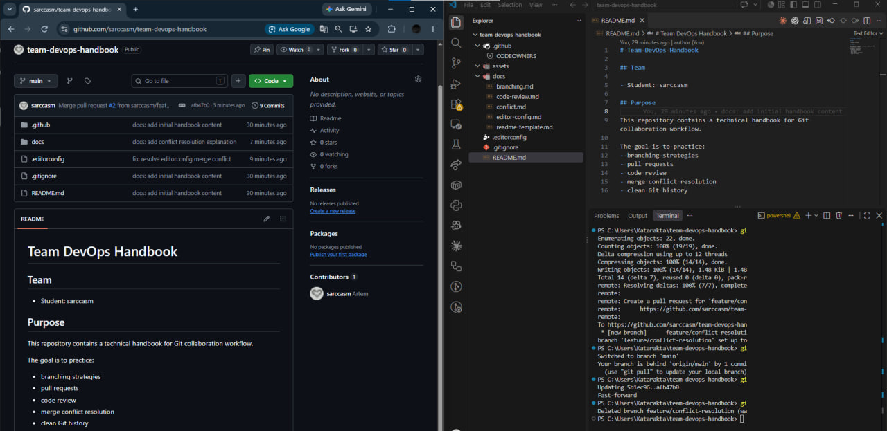
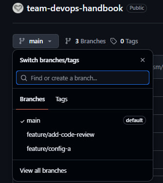
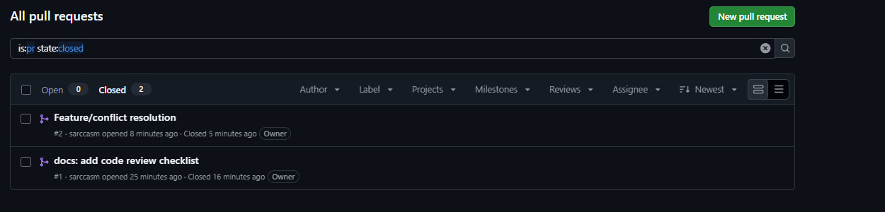
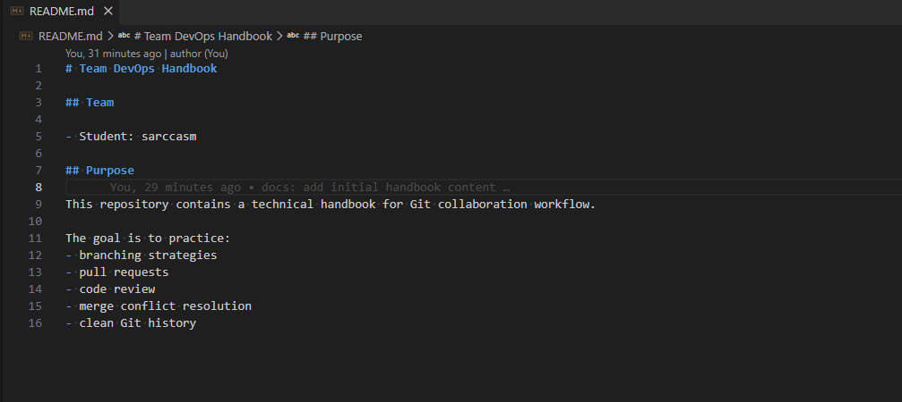
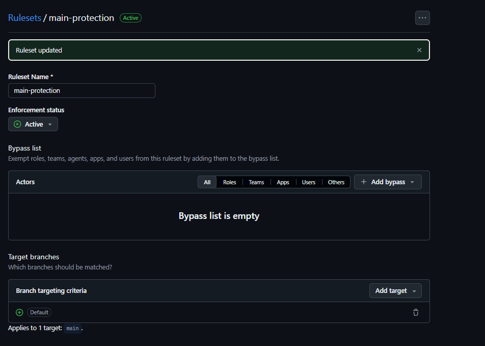

# Team DevOps Handbook

## Team

- Student: sarccasm

## Purpose

This repository contains a technical handbook for Git collaboration workflow.

The goal is to practice:
- branching strategies
- pull requests
- code review
- merge conflict resolution
- clean Git history
- Collaboration workflow tested with second contributor

## Screenshots

### Repository Structure

### Branching Strategy

### Pull Request Workflow

### Code Review Checklist

### Merge Conflict Resolution

### Main Branch Protection

### Collaboration with Second Contributor

